# Claude Lifeline

**Your Claude Code session dies at 2am from a rate limit. Lifeline waits it out and tells it to continue.**

A long agent run ends when the API hiccups — a rate limit, a 503, a dropped stream. The work is fine, the context is fine, but the turn is over and nothing picks it back up until you notice. Lifeline notices instead.

It hooks into Claude Code's own failure event, waits for the appropriate backoff, and injects a message that resumes the turn exactly where it stopped.

<p align="center">
  <a href="#install"></a>
  
  
  
  
</p>

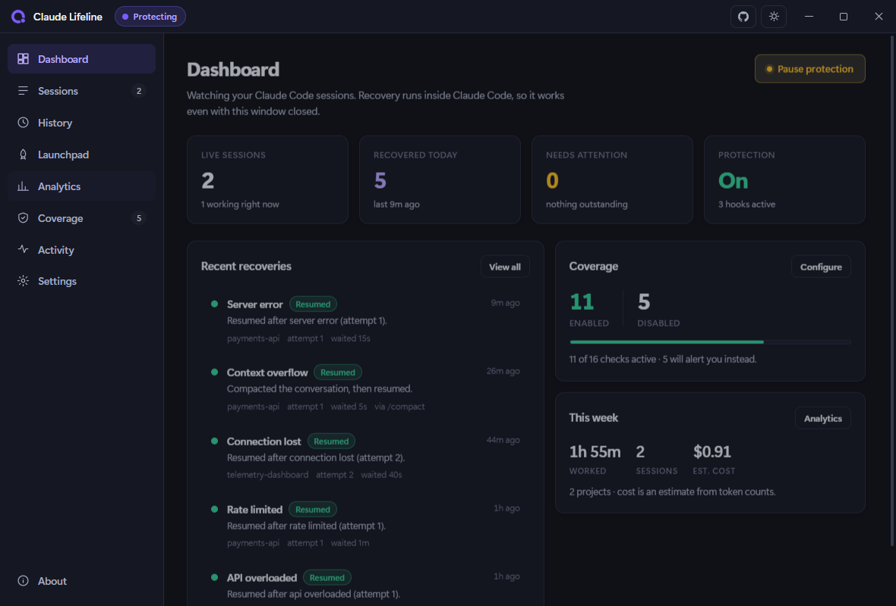

---

## Quick start

Two commands and one double-click, depending on how much you want.

**Just protect my sessions** — no app, no tray icon, nothing running:

```bash
git clone https://github.com/AndreiElekesIntel/claude-lifeline.git
cd claude-lifeline
npm install
npm run install-hook
```

**Everything, set up for me** — hooks, the tray app, a desktop shortcut, start-at-logon, every feature on. Double-click **`run.bat`** in the repo root, or:

```bash
run.bat
```

**Just give me the .exe** — grab it from the [**latest release**](https://github.com/AndreiElekesIntel/claude-lifeline/releases/latest):

| Download | What it is |
|---|---|
| `Claude Lifeline Setup 1.1.0.exe` | per-user installer — desktop shortcut, choosable install directory |
| `Claude Lifeline 1.1.0.exe` | portable — runs from wherever you put it, installs nothing |

> The installer registers the recovery hooks on first launch, so the .exe alone is a complete install. See [Install](#install) for verification and the SmartScreen note.

**Claude Code reads hooks at startup, so restart any session that is already running.**

---

## How it works

Claude Code fires a `StopFailure` event when an API error ends a turn, instead of the normal `Stop`. Lifeline registers a hook on that event with `asyncRewake` enabled. The hook classifies the failure, waits out the backoff, and exits with **code 2** — which is how a hook injects a message and wakes the model.

```
turn dies (rate limit)
        ↓
StopFailure  →  Lifeline hook
                  ├─ retryable?          no  → log it, notify you, stop
                  ├─ within limits?      no  → log it, stop
                  ├─ wait out backoff    (60s for a rate limit)
                  └─ exit 2 + message    → model wakes and continues
```

**The recovery runs inside Claude Code's own process.** That is the important architectural consequence: nothing has to be running for your sessions to be protected. No watchdog process, no polling, no window open. The tray app is *optional* — it shows you what happened and lets you configure it, and you can quit it without losing protection.

The full mechanism, including the payload shape and how each finding was verified, is in [**docs/HOW-IT-WORKS.md**](docs/HOW-IT-WORKS.md).

---

## What it recovers from

Not every failure should be retried, and that distinction is the core of the design. A rate limit clears on its own, so waiting is the right move. An invalid API key fails identically on every attempt — retrying it burns the attempt budget and buries the one message that tells you what to fix.

| Failure | What Lifeline does | Why |
|---|---|---|
| `rate_limit` | waits 60s, resumes | the limit clears with time |
| `overloaded` | waits 30s, resumes | server-side capacity, transient |
| `server_error` | waits 15s, resumes | a 5xx usually succeeds on retry |
| `unknown` (dropped connection, timeout) | waits 20s, resumes | the common overnight-failure case |
| `max_output_tokens` | resumes from the cut | continuing from the truncation is valid |
| `invalid_request` (context too long) | `/compact`, then resumes | retrying unchanged repeats the failure |
| `authentication_failed` | **alerts you** | credentials are wrong; no retry can fix it |
| `oauth_org_not_allowed` | **alerts you** | an org policy decision |
| `billing_error` | **alerts you** | needs a billing change |
| `model_not_found` | **alerts you** | a bad model id is a config error |

The Coverage tab is that table, live — every way a turn can end, what happens to it, and a switch on each one:

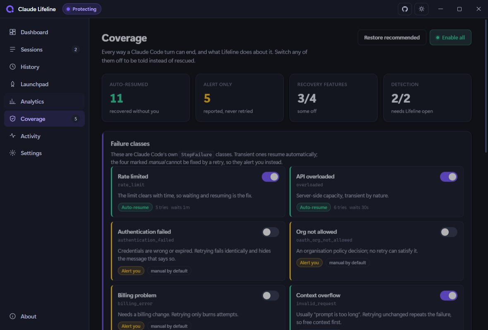

Turning a class off downgrades it to alert-only rather than ignoring it. Turning a *hopeless* class on is held back by a guard that explains why, because auto-resuming an expired credential just hides the message that says so.

### Beyond API errors

- **Background tasks still running** when a turn ends — resumes once they report back
- **Tool timeouts and interruptions** — optionally nudges the model instead of letting the turn end
- **Stalled sessions** — flags a session that claims to be working but has not progressed
- **Dead sessions** — notices when the CLI process vanished mid-task

---

## Safety: why this cannot spin

Auto-resume has one serious failure mode — retrying a permanent error forever, spending tokens on every pass. Four independent limits must *all* pass before a resume happens:

| Limit | Default | Stops |
|---|---|---|
| per prompt | 5 | one stuck prompt retrying without end |
| per hour | 20 | a single session bursting |
| per day | 100 | runaway spend, machine-wide |
| cooldown | 5s | duplicate fires for one failure |

Waits grow exponentially (`base × 2ⁿ`, capped at 5 minutes), so a persistent problem backs off instead of hammering. Attempts are recorded in a ledger keyed by `prompt_id`, so a *new* prompt gets a fresh budget while a stuck one cannot spin.

The hook is also written to fail safe: **any unexpected error exits 0.** Lifeline must never be the reason a session breaks.

---

## The app

Seven tabs, dark and light, and a tray icon whose colour tells you the state at a glance: **violet** protecting active work, **blue** waiting for sessions, **amber** something needs you, **grey** paused.

### Sessions

Every Claude Code session on the machine, live — including what each one has cost so far. Strictly read-only: it reads the JSON records Claude Code maintains and probes liveness with signal 0, which tests for a process without affecting it. Watching your sessions can never disturb them.

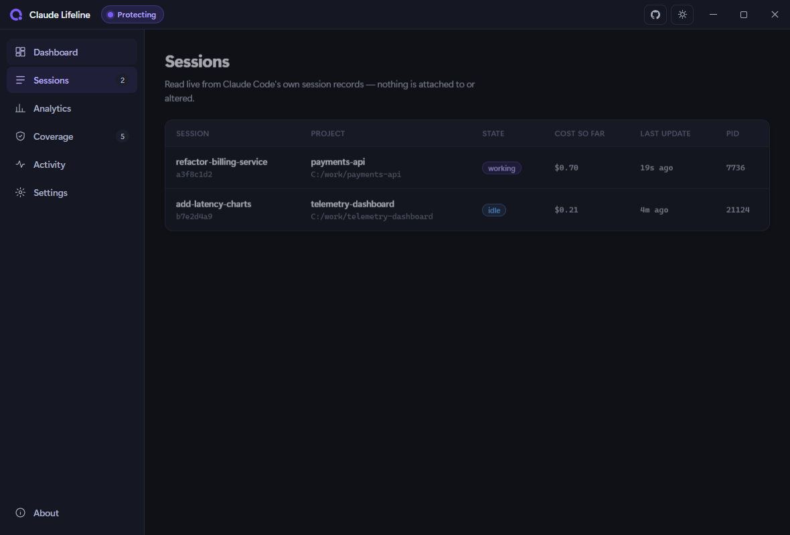

### Analytics

Time worked, sessions, tokens and estimated spend — computed here, on this machine, from transcripts Claude Code already wrote. Nothing is sent anywhere and nothing is written back. Every figure and chart answers to the range picker at the top: a week, a month, three, six, twelve, or all time.

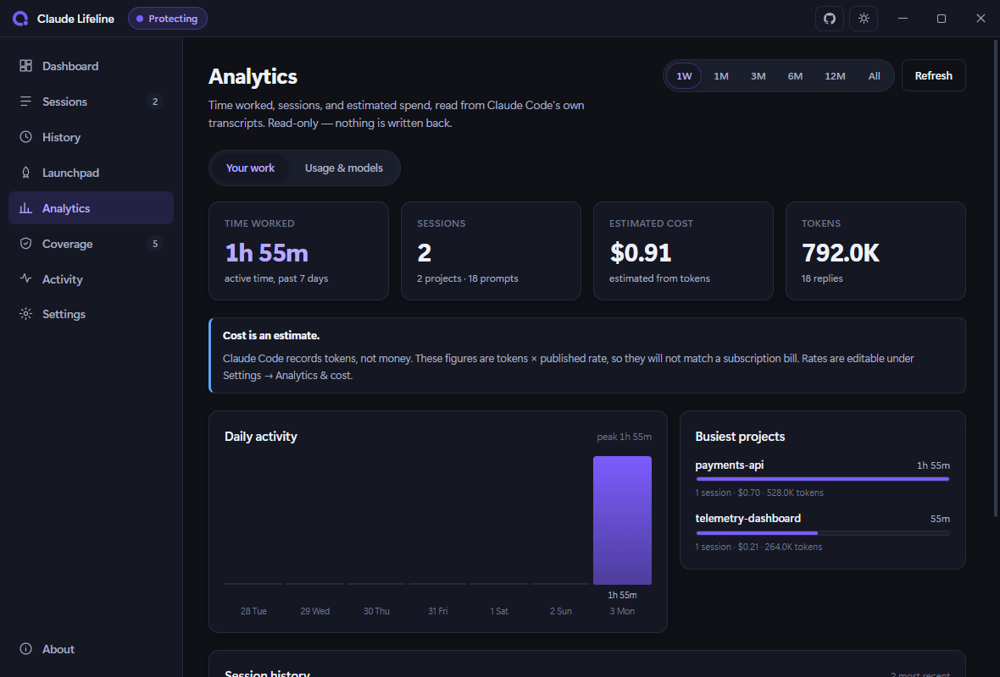

There is a second view over Claude Code's own `/usage` statistics, which knows things transcripts do not — all-time totals, per-model splits, your longest session ever. It takes the same range:

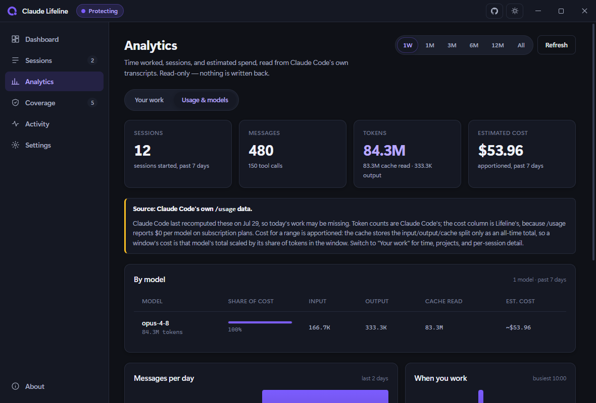

Windowed per-model costs are marked as apportioned, and they are: `/usage` records the input/output/cache split only as an all-time total, and those four are priced about tenfold apart, so a window can only scale the model's all-time cost by its share of the tokens. At all time the figures are measured, not apportioned.

Cost is an estimate by construction: Claude Code records tokens, not money, so these are tokens × published rate and will not match a subscription bill. The rates are editable under Settings → Analytics & cost for exactly that reason.

### Activity

Every recovery, skip, and block, filterable by kind. This is the answer to "what happened while I was asleep".

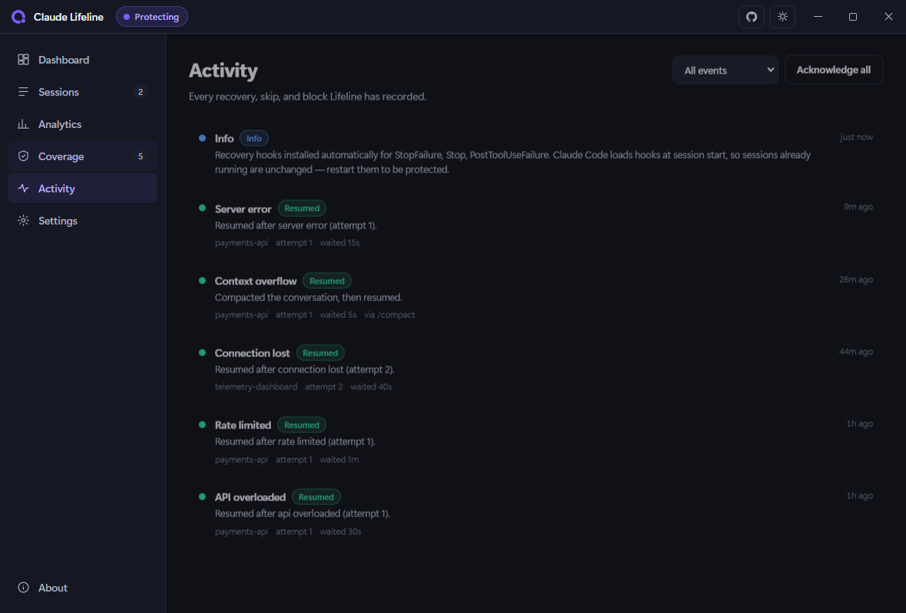

### Settings

Feature toggles, the four safety limits, analytics, and per-project allow/deny lists.

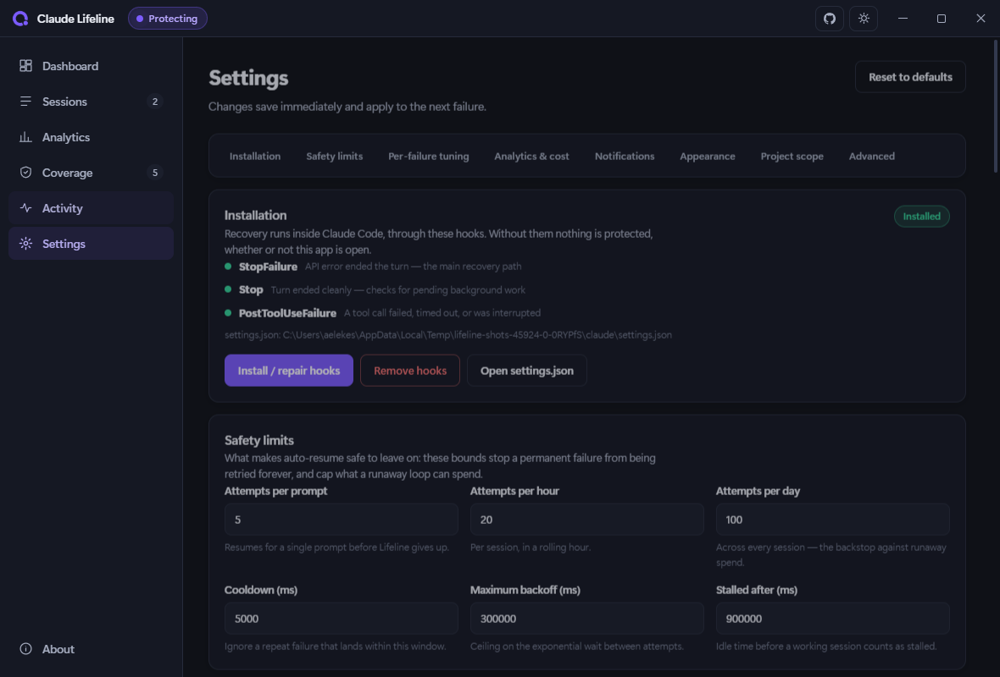

Below that, the per-failure policy table — wait, attempt cap, and strategy for each of the ten classes:

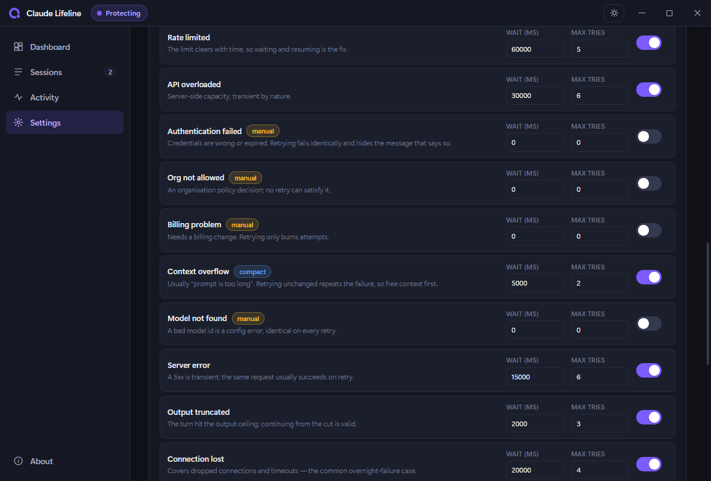

### About

A doctor's-eye view of the install — what is registered, how many checks are armed, and how many recoveries have actually happened:

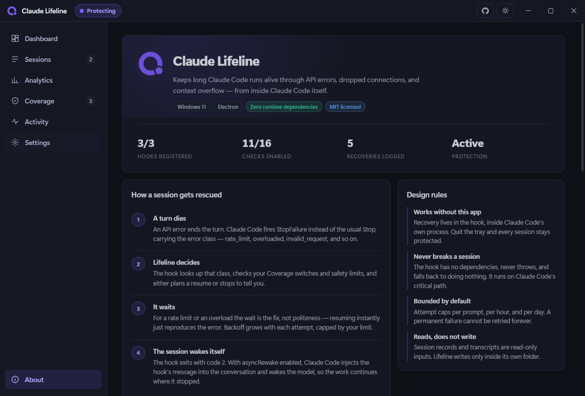

Scroll down and it tells you where every byte it writes lives, so you can go and read it:

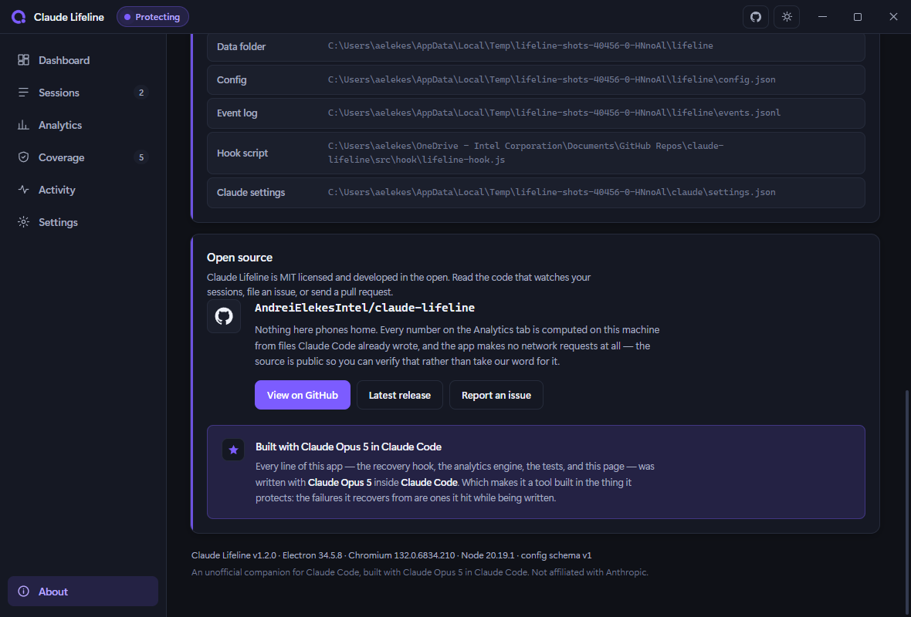

### Light theme

Follows Windows by default, or pick one.

| | |
|---|---|
| 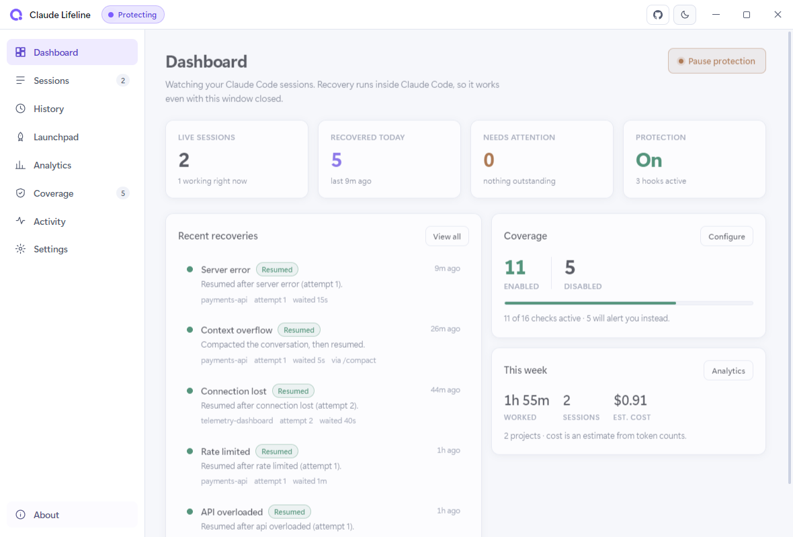 | 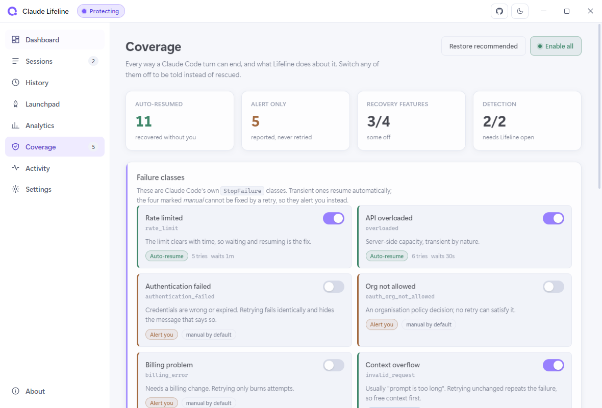 |
| 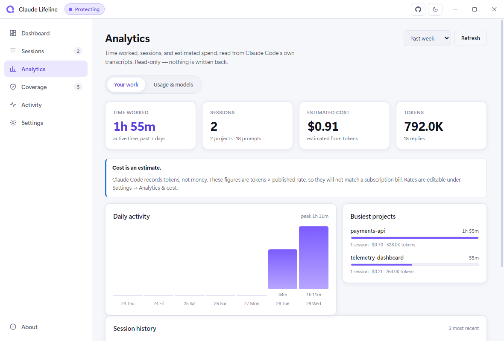 | 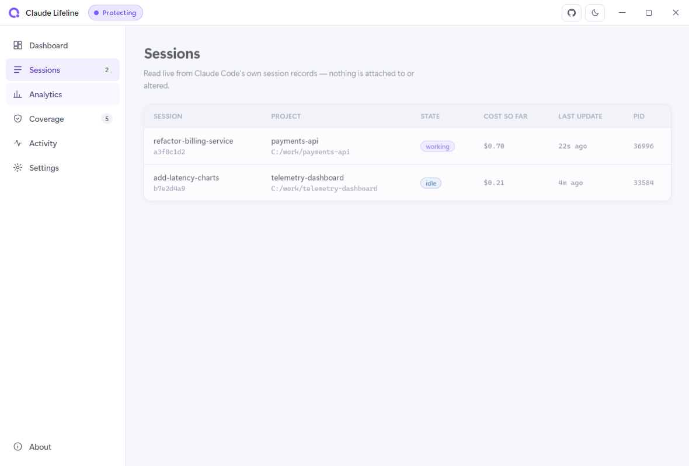 |
| 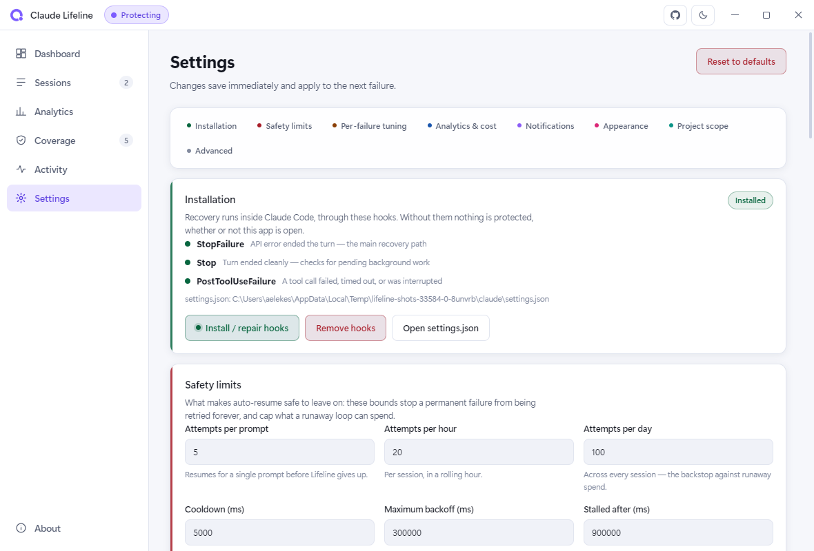 | 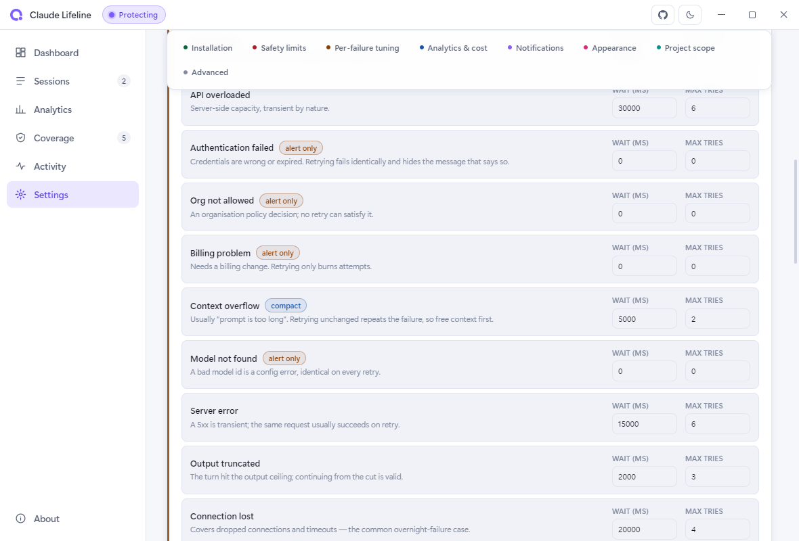 |

---

## Install

Requires Windows 10 or 11 and Node 20+. Nothing needs administrator rights — everything written lives under your own user profile.

### Option 1 — `run.bat` (does everything)

Double-click `run.bat`, or run it with flags:

```bash
run.bat                  # install, register hooks, build, shortcuts, autostart, launch
run.bat -SkipBuild       # skip the packaged build; autostart runs from this checkout
run.bat -NoLaunch        # set everything up but do not start the app
run.bat -Proxy ""        # install without a proxy (defaults to Intel's)
```

It is idempotent — re-running repairs a partial install rather than duplicating anything. The hooks go in first, before the app and the shortcuts, so that if a later step fails the machine is still protected.

### Option 2 — by hand

```bash
npm install
npm run install-hook     # this is the part that protects your sessions
npm start                # optional: the tray app
npm run build            # optional: build the installer + portable exe into dist/
powershell -ExecutionPolicy Bypass -File scripts\install-autostart.ps1   # optional: start at logon
```

### Verify

```bash
npm run doctor
```

```
✓ Node 24.15.0
✓ Hook script present
✓ Recovery hooks registered  StopFailure, Stop, PostToolUseFailure
✓ Protection enabled
✓ API error recovery on
✓ Data folder writable

Everything checks out. Your sessions will resume themselves after an API error.
```

### Uninstall

```bash
npm run uninstall-hook                                                   # remove the hooks
powershell -ExecutionPolicy Bypass -File scripts\install-autostart.ps1 -Uninstall
```

Uninstalling is recorded as a decision, so the app will not quietly reinstall the hooks on its next launch.

### The unsigned-binary note

`npm run build` produces two artifacts in `dist/`, neither of which is code-signed:

| | |
|---|---|
| `Claude Lifeline Setup 1.1.0.exe` | per-user installer, choosable install directory, desktop shortcut |
| `Claude Lifeline 1.1.0.exe` | portable — runs without installing |

Because they are unsigned, SmartScreen will warn on first run. Build from source or use *More info → Run anyway*.

<details>
<summary>Why the build goes through <code>scripts/build.mjs</code></summary>

Two things in electron-builder's toolchain download fail on a stock Windows 11 machine, and both are avoidable, so `npm run build` wraps it:

- Its `winCodeSign` bundle contains **macOS symlinks**. Creating a symlink on Windows needs Developer Mode or an elevated shell, so extraction fails with *"Cannot create symbolic link : A required privilege is not held by the client"* — after three retries. Those files are the macOS signing toolchain and a `--win` build never reads them, so the wrapper pre-populates the cache with everything except `darwin/`.
- Its Go helper shells out to `7za`, which it expects on `PATH` while npm only installs it under `node_modules/7zip-bin`.

The wrapper only affects the build environment — it changes nothing about the app. If a future electron-builder upgrade wants a different bundle version, bump `WIN_CODE_SIGN` in that script to the version named in the error.

</details>

<details>
<summary>Why a Scheduled Task and not a Windows service?</summary>

A Windows service runs in session 0, which has no desktop — it cannot draw a tray icon or raise a toast. A Scheduled Task triggered at logon is the supported way to get service-like autostart for an app with a UI. It needs no elevation, since everything Lifeline touches lives under your user profile.

</details>

---

## Extras

### Keep recovery working while you edit the code

The hooks point at a path. If that path is your working tree, an edit mid-session runs half-written code.

```bash
npm run pin
```

This snapshots the recovery code to `%APPDATA%\claude-lifeline\runtime\` and re-registers the hooks against the snapshot, so your live sessions keep being rescued by a known-good copy while you work on the next one. `npm run pin` again to publish, `npm run install-hook` to go back to tracking the tree.

### Shut the machine down when the work is genuinely finished

An overnight run that finishes at 3am leaves a laptop on until morning. This checks, and only powers off if everything is really done:

```bash
npm run shutdown-check                                                          # report only, never acts
powershell -ExecutionPolicy Bypass -File scripts\schedule-shutdown.ps1 -At 05:00 -DryRun
powershell -ExecutionPolicy Bypass -File scripts\schedule-shutdown.ps1 -At 05:00
```

The decision is a **veto, not a score**: anything unexplained blocks it. A busy session, a turn that ended mid-tool-call, a recent recovery attempt, or anything flagged for attention all refuse the shutdown — and it keeps re-checking through a 90-minute grace period, because the case it exists for is a session three minutes into a five-attempt rate-limit backoff at the moment the clock strikes. If in doubt, the machine stays on.

Start with `-DryRun`. It registers a task that reports its decision and shuts nothing down.

---

## Configuration

`%APPDATA%\claude-lifeline\config.json`, editable from the Settings tab. A corrupt or missing file falls back to defaults rather than throwing — a broken config is not a reason to stop rescuing sessions. A config written by an older version is upgraded on load, and keys written by a *newer* version are preserved rather than stripped.

```jsonc
{
  "enabled": true,                     // master switch; off means the hook does nothing
  "features": {
    "apiErrorRecovery": true,          // the core feature
    "contextOverflowRecovery": true,   // /compact when context overflows
    "toolFailureRecovery": false,      // nudge on tool timeouts — noisier, so off
    "backgroundTaskRecovery": true,
    "stalledSessionDetection": true,
    "deadSessionDetection": true,
    "desktopNotifications": true,
    "soundAlerts": false,
    "respectNonRetryable": true        // keep auth/billing on alert-only
  },
  "limits": {
    "maxAttemptsPerPrompt": 5,
    "maxAttemptsPerHour": 20,
    "maxAttemptsPerDay": 100,
    "cooldownMs": 5000,
    "maxBackoffMs": 300000,
    "stalledAfterMs": 900000
  },
  "analytics": {
    "enabled": true,                   // read transcripts for time/token/cost reporting
    "rates": {}                        // per-model overrides, USD per million tokens
  },
  "hooks": {
    "autoInstall": true                // register missing hooks at startup
  },
  "advanced": {
    "projectDenylist": [],             // never recover these paths
    "projectAllowlist": [],            // empty = all projects
    "debugLogging": false
  }
}
```

| Path | What |
|---|---|
| `%APPDATA%\claude-lifeline\config.json` | your settings |
| `%APPDATA%\claude-lifeline\events.jsonl` | what happened, append-only |
| `%APPDATA%\claude-lifeline\ledger.json` | attempt counts (the loop guard) |
| `%APPDATA%\claude-lifeline\runtime\` | the pinned snapshot, if you ran `npm run pin` |
| `%APPDATA%\claude-lifeline\backups\` | settings.json backups, taken before every install |
| `~\.claude\settings.json` | where the hooks are registered |

**Nothing here phones home.** Lifeline makes no network requests at all — every number on the Analytics tab is computed on this machine from files Claude Code already wrote. The source is public so you can check that rather than take our word for it.

---

## Development

```bash
npm test             # 141 unit tests
npm run test:e2e     # 44 Playwright tests against the real Electron app
npm run lint         # project-specific invariant checks
npm run screenshots  # regenerate docs/screenshots/
npm run dev          # run with devtools open
npm run build        # installer + portable exe into dist/
```

Tests redirect `LIFELINE_HOME` and `CLAUDE_CONFIG_DIR` to a throwaway directory and give each one its own Electron `--user-data-dir`, so a test run can never read your real sessions, rewrite your real `settings.json`, or collide with a tray app you have open.

```
src/
  hook/lifeline-hook.js   the actual fix — runs inside Claude Code, no dependencies
  shared/policy.js        per-failure decisions and rationale
  shared/ledger.js        the four-way loop guard
  shared/installer.js     safe settings.json editing (backs up, merges, never clobbers)
  shared/analytics.js     transcript reading: time, tokens, cost
  shared/idle-shutdown.js the "is everything really finished" veto
  main/                   Electron main, tray, monitor
  renderer/               the UI
scripts/
  cli.mjs                 install / uninstall / pin / doctor / status
  idle-shutdown.mjs       the scheduled shutdown check
  build.mjs               packaging, with the Windows toolchain workarounds
  make-icons.mjs          generates assets/icon.ico from the tray drawing code
```

### Design notes

- **Zero runtime dependencies.** The hook is spawned as a bare Node process by Claude Code; it cannot rely on module resolution or an install step.
- **The tray icon is generated at runtime** — PNGs encoded with Node's built-in `zlib`, so status colours and DPI variants need no image assets.
- **The renderer is locked down**: `contextIsolation: true`, `nodeIntegration: false`, a strict CSP, and no `innerHTML` anywhere. Event details carry API error text and session names, which are untrusted strings; lint enforces this. Outbound links are passed to main as *keys*, never URLs, so an injected string cannot become a browser launch.
- **Hook installation is non-destructive**: it backs up `settings.json`, merges into existing hook groups, tags its own entries, and *aborts* rather than overwriting a file it cannot parse.
- **The screenshots in this README are generated by a test.** They are captured by `test/e2e/screenshots.spec.js` against the real app, so an image can never show a UI that no longer passes its own suite.

---

## Contributing

Issues and pull requests are welcome — the most valuable report is a way a session can die that Lifeline does not catch yet. `main` is protected, so changes land through a reviewed PR:

1. Fork, then branch from `main`.
2. Make the change, and add a test that would have failed before it.
3. `npm test && npm run test:e2e && npm run lint` — all three must be clean. CI runs the same on Windows.
4. Open a PR describing what failure mode the change addresses.

[**CONTRIBUTING.md**](CONTRIBUTING.md) has the house rules, the invariants lint enforces, and what to establish before proposing that a new failure class auto-resume.

Comments here explain *why*, not what. If a line looks odd, the odd part is usually the point — say so in a comment rather than leaving the next reader to rediscover it.

---

## Limitations

- **Windows-first.** The hook is cross-platform; the tray app, autostart, and shutdown scripts are Windows-specific.
- **Not retroactive.** Sessions running before you install the hooks are not protected until restarted.
- **Interactive sessions only.** `asyncRewake` needs an interactive or streaming-input session; plain `claude -p` print mode exits before a rewake can land.
- **Cost is an estimate.** Tokens × published rate, which is not what a subscription bills.
- **Uses internal hook options.** `asyncRewake` is not part of Claude Code's documented public API and could change between releases. `npm run doctor` will tell you if the wiring stops matching.

---

## License

MIT. Built with **Claude Opus 5** in **Claude Code** — which makes it a tool built inside the thing it protects: the failures it recovers from are ones it hit while being written.

Not affiliated with Anthropic.
