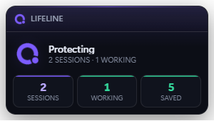
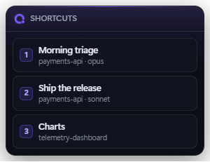

# Claude Lifeline

**Your Claude Code session dies at 2am from a rate limit. Lifeline waits it out and tells it to continue.**

A long agent run ends when the API hiccups — a rate limit, a 503, a dropped stream. The work is fine, the context is fine, but the turn is over and nothing picks it back up until you notice. Lifeline notices instead.

It hooks into Claude Code's own failure event, waits for the appropriate backoff, and injects a message that resumes the turn exactly where it stopped.

<p align="center">
  <a href="https://github.com/AndreiElekesIntel/claude-lifeline/releases/latest"></a>
  
  
  
  
</p>


---

## Get started

```bash
git clone https://github.com/AndreiElekesIntel/claude-lifeline.git
cd claude-lifeline
npm install
npm run install-hook
```

That is the whole feature — the recovery runs inside Claude Code, so nothing needs to be left running. **Restart any session that is already open**, since Claude Code reads hooks at startup.

Want the tray app, a desktop shortcut and start-at-logon too? Double-click **`run.bat`**. Prefer a binary? Take one from the [**latest release**](https://github.com/AndreiElekesIntel/claude-lifeline/releases/latest).

→ **[Getting Started](https://github.com/AndreiElekesIntel/claude-lifeline/wiki/Getting-Started)** has all three routes, and `npm run doctor` to check the install.

---

## What the app adds

The recovery needs none of this — it runs inside Claude Code. But once there is a window, there are things worth putting in it:

| | |
|---|---|
| **History** | every session ever recorded on the machine, searchable, resumable in one click |
| **Launchpad** | sessions you start often, saved as presets with a global hotkey each |
| **Analytics** | time, tokens and estimated spend, computed on your machine from transcripts |
| **Desktop widgets** | your shortcuts, or Lifeline's status, floating on the wallpaper — as a card, a bar, or an orb |

<p align="center">
  
  
</p>

---

## Documentation

Everything is in the [**wiki**](https://github.com/AndreiElekesIntel/claude-lifeline/wiki).

| | |
|---|---|
| [**How It Works**](https://github.com/AndreiElekesIntel/claude-lifeline/wiki/How-It-Works) | the `StopFailure` hook, exit code 2, and why nothing has to be running |
| [**What It Recovers From**](https://github.com/AndreiElekesIntel/claude-lifeline/wiki/What-It-Recovers-From) | all ten failure classes — which are waited out, which alert you, and why |
| [**Safety**](https://github.com/AndreiElekesIntel/claude-lifeline/wiki/Safety) | the four limits that make auto-resume unable to spin |
| [**The App**](https://github.com/AndreiElekesIntel/claude-lifeline/wiki/The-App) | every tab and both desktop widgets, with screenshots |
| [**Install and Uninstall**](https://github.com/AndreiElekesIntel/claude-lifeline/wiki/Install-and-Uninstall) | full reference, verification, SmartScreen, autostart |
| [**Configuration**](https://github.com/AndreiElekesIntel/claude-lifeline/wiki/Configuration) | every key, and where each file lives on disk |
| [**Extras**](https://github.com/AndreiElekesIntel/claude-lifeline/wiki/Extras) | `npm run pin`, and powering the machine off when work is genuinely finished |
| [**Development**](https://github.com/AndreiElekesIntel/claude-lifeline/wiki/Development) | tests, layout, design notes, contributing |
| [**Limitations**](https://github.com/AndreiElekesIntel/claude-lifeline/wiki/Limitations) | what this does not do |

The wiki pages are version-controlled in [`docs/wiki/`](docs/wiki) and mirrored, so documentation changes go through the same review as code. The deep mechanism write-up stays in [`docs/HOW-IT-WORKS.md`](docs/HOW-IT-WORKS.md).

---

## In one paragraph

Claude Code fires `StopFailure` when an API error ends a turn. Lifeline registers a hook on it, classifies the failure, waits out the backoff, and exits with code 2 — which is how a hook injects a message and wakes the model. Retryable failures are waited out; hopeless ones like a bad credential alert you instead, because retrying them burns the attempt budget and buries the message that says what to fix. Four independent limits must all pass before any resume, and any unexpected error in the hook exits 0: Lifeline must never be the reason a session breaks.

**Nothing here phones home.** No network requests at all — every figure on the Analytics tab is computed on your machine from files Claude Code already wrote.

---

## Contributing

The most valuable report is a way a session can die that Lifeline does not catch yet. `main` is protected, so changes land through a reviewed PR with `npm test && npm run test:e2e && npm run lint` clean. See [CONTRIBUTING.md](CONTRIBUTING.md) and [Development](https://github.com/AndreiElekesIntel/claude-lifeline/wiki/Development).

## License

MIT. Built with **Claude Opus 5** in **Claude Code** — which makes it a tool built inside the thing it protects: the failures it recovers from are ones it hit while being written.

Not affiliated with Anthropic.
